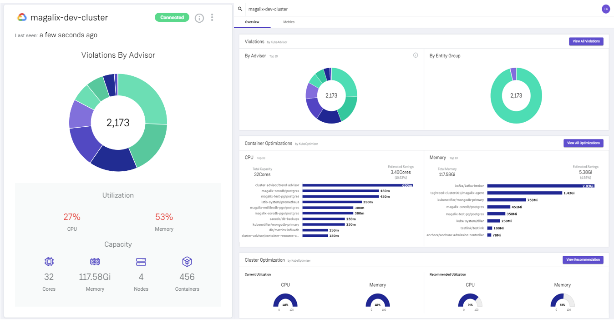

# Magalix Agent - Overview 

  

Magalix provides unique insights and recommendations about governance, security, and resources utilization within your Cloud-Native environment. The Magalix agent performs several tasks: 
1. It assists with right sizing Kubernetes cluster by dynamically managing resources of pods and containers. Save up to 50% of your cloud bill. Stay on top of capacity management. 
2. Allows out-of-the-box, or custom policies-as-code (Rego based) between one, to many of your Kubernetes clusters regardless of where it is hosted, and who it is managed by. 
3. Interfaces with your Kube-APIserver / RBAC to gather only the information necessary to provide performance and policy based analytics. 

### Core Magalix Features
- Enforce policies at Build, Deploy and Run Time
- Apply an ever-growing list of policies developed by our internal policy team. 
- Create your own set of policies from scratch, or leverage our templated policies to help boostrap your efforts. 
- Automatically apply optimizations with minimal or no disruption to operations
- Gain detailed recommendations to right size cluster VMs
- Provide notification hooks for various external systems when certain events are triggered. 

### Core Optimization Insights
- What is the distribution of CPU, memory, and network across the whole cluster? 
- How will utilization look like the next few hours?
- Are there any unusual usage patterns?
- How does the change in cluster size impacts performance?

# Documentation

The general documentation of the Magalix and its agent, including instructions for installation and dashboards, is located under the [docs website](https://docs.magalix.com).

# Installation
A valid account is required to run the agent properly. Please contact sales@magalix.com to set up demo. 

## Directly through Magalix.com 

1. Go to [https://console.magalix.com](https://console.magalix.com) after your account has been created.
2. Copy and paste the provided `kubectl` command into your shell. 
3. It will install Magalix agent with the proper credentials to read your metrics and generate recommendations. 

## Via GKE Marketplace

You can install Magalix agent through GKE marketplace. 

### First Time User
1. Insert your email in GKE installation/configuration form. The deployment container will create an account and connect the agent to this account.
2. Once installation is successfully complete, you will receive an email with instructions to see your clusters dashboard at [Magalix console](https://console.magalix.com).
3. If you didn't receive that welcome email for some reason, you can just go through the [reset password process](https://console.magalix.com/auth/#/forgot-password).

### If you have an Existing Magalix Account
1. Insert your email and password in GKE installation/configuration form. The deployment container will define a new cluster under your account and use generated secrets to connect the installed agent with your account. 
2. Once installation is successfully complete, you will receive an email confirming cluster connectivity.

# Accessing Insights and Recommendations
A few minutes after the agent is installed, metrics will start to flow. The Magalix Analytics and Recommendations engine will generate predictions and recommendations in a few hours. You will also receive email notifications when recommendations are generated.

# Updating The Agent's Image
If you need to update the running agent's installation, you will receive an email that you should do. Because the image pull policy is set to Always, everytime you delete the pod, a fresh image will be installed. 

# Removing Magalix Agent

You can remove Magalix agent by simply deleting its Deployment controller, which is named magalix-agent. This will remove all the agent's pods and associated resources. 

# Troubleshooting 

The most common issues that users face installing Magalix agent is RBAC. Please read our [troubleshooting guide](https://docs.magalix.com/docs/connecting-clusters) to resolve initial setup issues you may encounter. 

# Questions and Support
Please reach out to us at our [support forum](https://docs.magalix.com/discuss) or send us an email at <support@magalix.com>.
